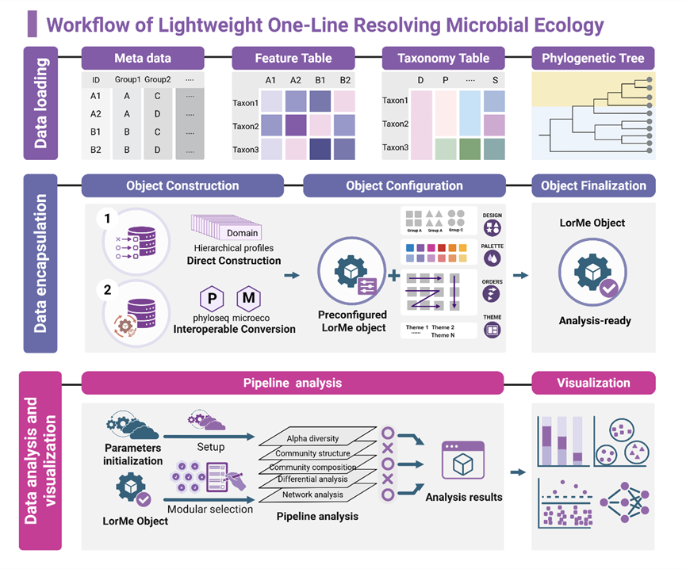
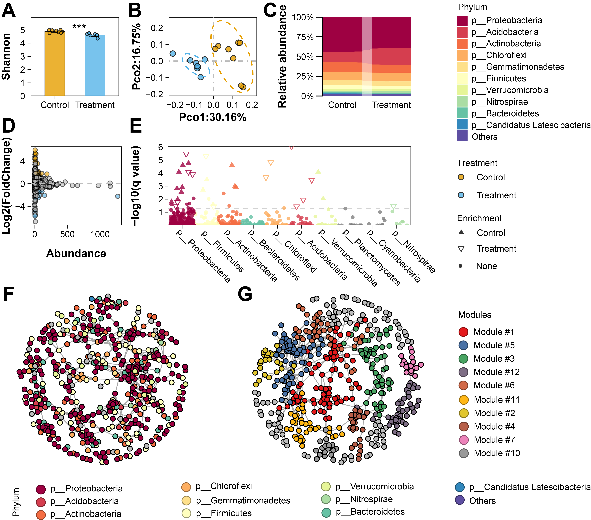

<!-- badges: start -->
[](https://cran.r-project.org/package=LorMe)
[](https://cran.r-project.org/package=LorMe)
<!-- badges: end -->
# Lightweight One-Line Resolving Microbial Ecology Program
LorMe is an R package designed to provide a streamlined, reproducible, and modular workflow for microbiome data analysis. Centered on a unified object structure and a global parameter system, LorMe integrates data preprocessing, taxonomic summarization, differential analysis, ecological network construction, and visualization into a coherent and user-friendly pipeline.

LorMe is built around three core principles: simplicity, consistency, and extensibility. Users start with only three basic inputs—metadata, feature table, and taxonomy table—and LorMe automatically encapsulates them into a standardized analysis-ready object. The package also supports seamless conversion from popular formats such as phyloseq and microeco, ensuring compatibility with existing workflows.

**Citation**: Wang, N., Zhang, Y., Yang, X., Gao, Y., Xia, H., Xu, Y., Shen, Q., Jousset, A., Jiang, G., and Wei, Z. (2025). LorMe: a streamlined and interoperable R framework for end-to-end microbiome analysis. bioRxiv, 2025.2011.2026.690896.


**Key Features**

**Unified object system**: All analyses operate on a standardized LorMe object, ensuring consistent structure and reproducible workflows.

**Global parameter management**: A centralized configuration system controls all analysis modules, reducing repeated parameter settings.

**One-line pipeline execution**: Run complete analyses—including diversity, composition, differential taxa, network, and meta-network—in a single command.

**Modular analytical components**: Each module (alpha/beta diversity, DESeq2, indicator analysis, composition profiling, networks) can be used independently or within pipelines.

**Built-in publication-ready visualizations**: High-quality plotting templates with customizable color schemes and layouts.

**Seamless compatibility**: Direct import from phyloseq or microeco objects without manual preprocessing.

With these strengths, LorMe provides an efficient, standardized, and intuitive framework for microbiome data analysis and figure generation. 

**Architecture of LorMe package**

**Workflow of LorMe package**



# Installation
Standard version from CRAN(V2.0.2)
```{R}
install.packages("LorMe")
```
Development version from GitHub (V2.0.2) :stuck_out_tongue_closed_eyes:
```{R}
if (!require(remotes)) install.packages("remotes")
remotes::install_github("wangnq111/LorMe")
```
LorMe will only update the major and minor versions on CRAN, but will update each patch version on GitHub. 
The following are the update logs that differ from the CRAN version:
12/01/26 LorMe in CRAN and github both updated to version 2.0.2
# Illustration
[Getting Started](https://wangnq111.github.io/Gettingstarted.html)
## Chinese version
Chinese illustration available at 🏮 [LorMe中文版说明书](https://rural-dianella-be0.notion.site/LorMe-aac2ba66a3bf46bd89c103e78550e6f4) 🏮

# Suggestions and bug report
2434066068@qq.com

## Visualization
**Representitive visualizations**



