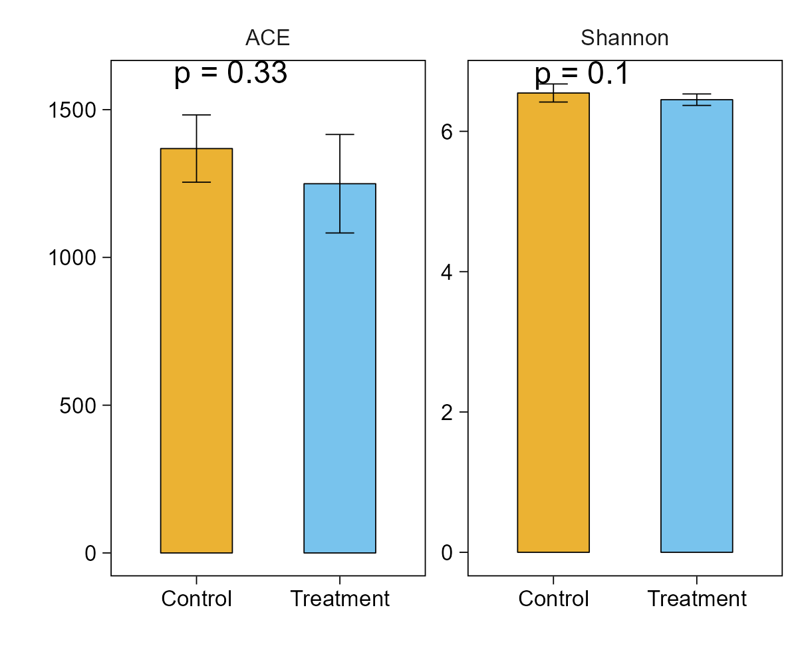
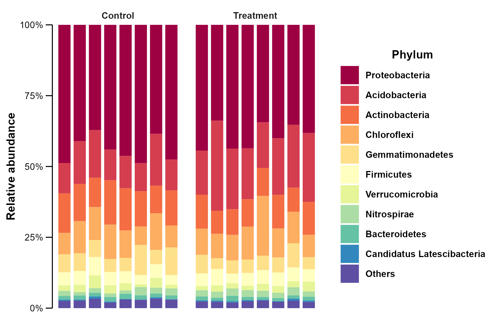
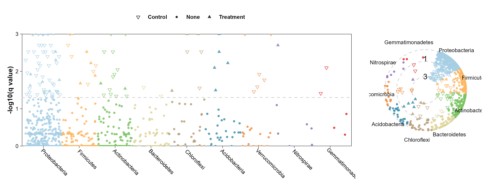
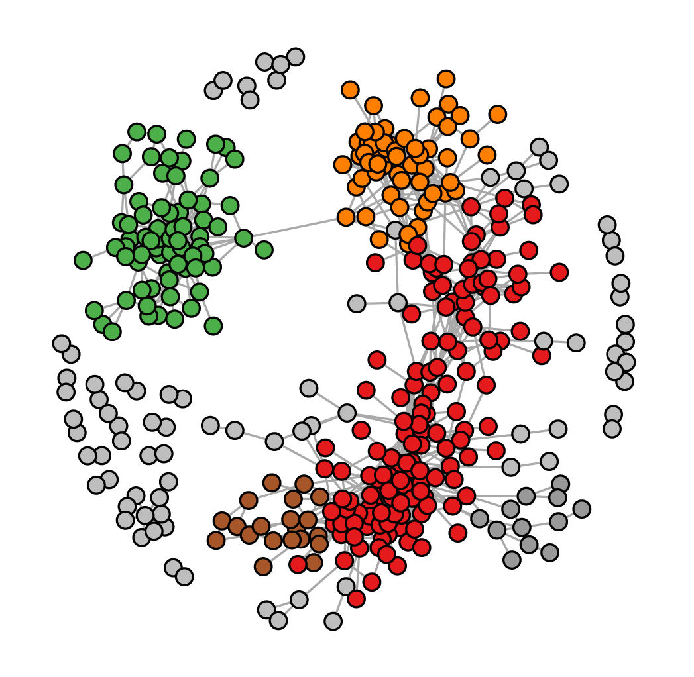
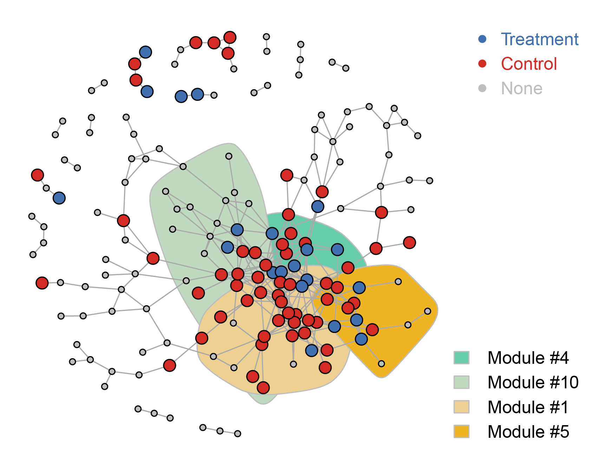
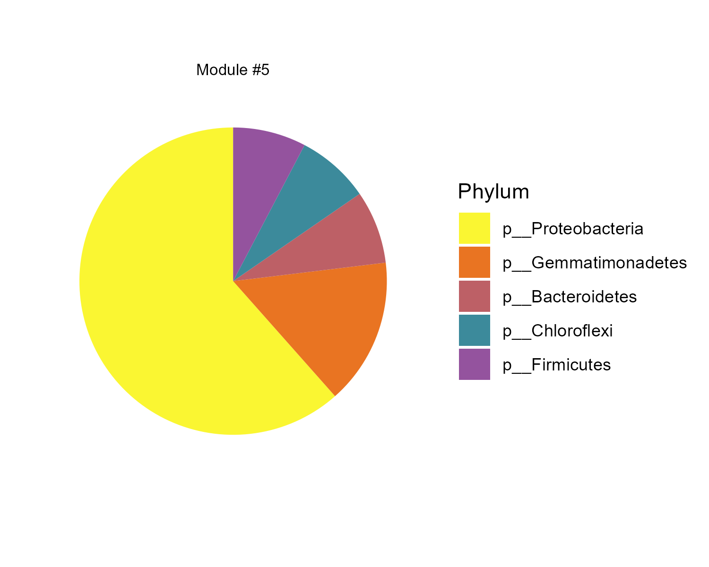

# LorMe
LorMe package for R：Lightening One-code Resolving Microbial Ecology Program. LorMe keeps updating and maintanence. 

# Suggestions and bug report
2434066068@qq.com

# Installation
development version from GitHub :stuck_out_tongue_closed_eyes:
```{R}
if (!require(remotes)) install.packages("remotes")
remotes::install_github("wangnq111/LorMe")
```


# Illustration
## Chinese version
Chinese illustration available at 🏮 [LorMe中文版说明书](https://rural-dianella-be0.notion.site/LorMe-aac2ba66a3bf46bd89c103e78550e6f4) 🏮
## Visualization

### Community Feature
#### Alpha diversity


#### Community Structure
Support three styles: ellipse (as in the below),stick and polygon


#### Community Composition
Support three styles: Bar plot (as in the below), Area plot and alluvial plot


### Differential Analysis
#### Differential Bar


#### Volcano Plot
Support Fold change-FDR plot and Mean-Fold change plot


#### Manhatton Plot
Support both classical style and circular style


### Network analysis
#### Classical network
Painted top five largest modules


#### Meta network
Painted differential taxon


#### Module composition pie chart
