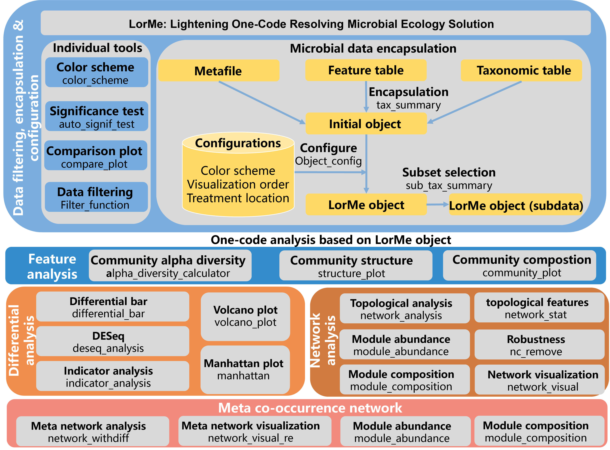

<!-- badges: start -->
[](https://cran.r-project.org/package=LorMe)
[](https://cran.r-project.org/package=LorMe)
<!-- badges: end -->
# LorMe package for R：Lightening One-code Resolving Microbial Ecology Solution
LorMe Provides a robust collection of functions tailored for microbial ecology analysis, encompassing both data analysis and visualization. It introduces an encapsulation feature that streamlines the process into a summary object. With the initial configuration of this summary object, users can execute a wide range of analyses with a single line of code, requiring only two essential parameters for setup. The package delivers comprehensive outputs including analysis objects, statistical outcomes, and visualization-ready data, enhancing the efficiency of research workflows. Designed with user-friendliness in mind, it caters to both novices and seasoned researchers, offering an intuitive interface coupled with adaptable customization options to meet diverse analytical needs. LorMe keeps updating and maintanence. 



# Installation
Standard version from CRAN
```{R}
install.packages("LorMe")
```
Development version from GitHub :stuck_out_tongue_closed_eyes:
```{R}
if (!require(remotes)) install.packages("remotes")
remotes::install_github("wangnq111/LorMe")
```
LorMe will only update the major and minor versions on CRAN, but will update each patch version on GitHub. 
The following are the update logs that differ from the CRAN version:

02/09/2024 Patch version 1.0.1 Hot fix: Added a self-check program to the configuration function; Fixed compatibility issues in 'differential_bar'; Corrected the vector types of some elements in the encapsulated functions.

# Illustration
[Getting Started](https://wangnq111.github.io/Gettingstarted.html)
## Chinese version
Chinese illustration available at 🏮 [LorMe中文版说明书](https://rural-dianella-be0.notion.site/LorMe-aac2ba66a3bf46bd89c103e78550e6f4) 🏮

# Suggestions and bug report
2434066068@qq.com

## Visualization

### Community Feature
#### Alpha diversity


#### Community Structure
Support three styles: ellipse (as in the below),stick and polygon


#### Community Composition
Support three styles: Bar plot (as in the below), Area plot and alluvial plot


### Differential Analysis
#### Differential Bar


#### Volcano Plot
Support Fold change-FDR plot and Mean-Fold change plot


#### Manhatton Plot
Support both classical style and circular style


### Network analysis
#### Classical network
Painted top five largest modules


#### Meta network
Painted differential taxon


#### Module composition pie chart

