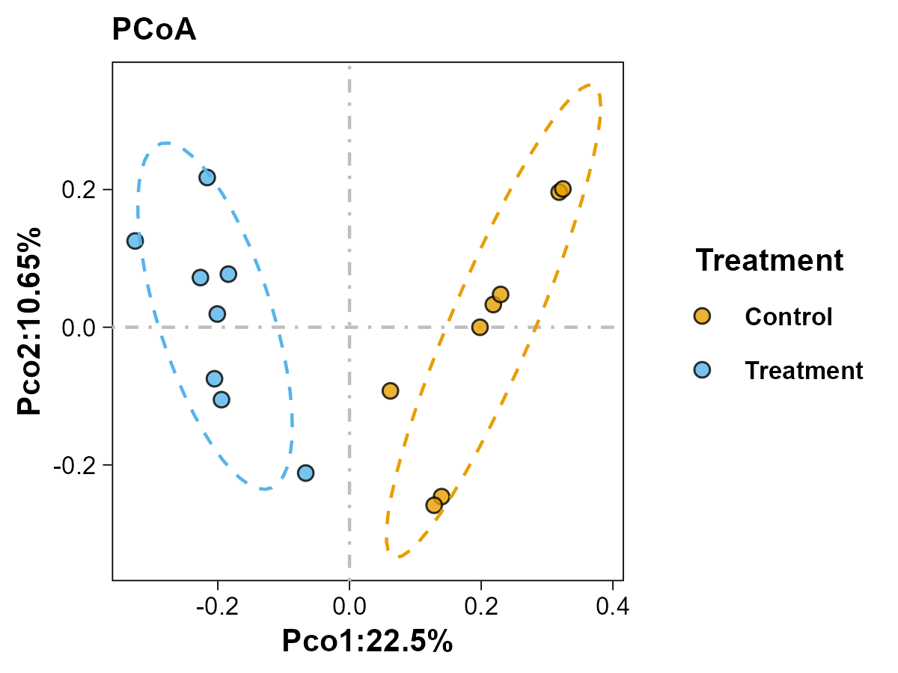
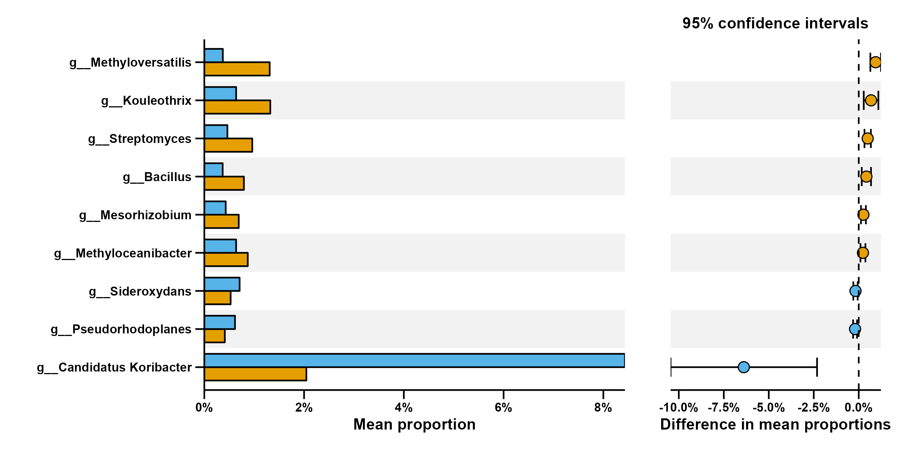
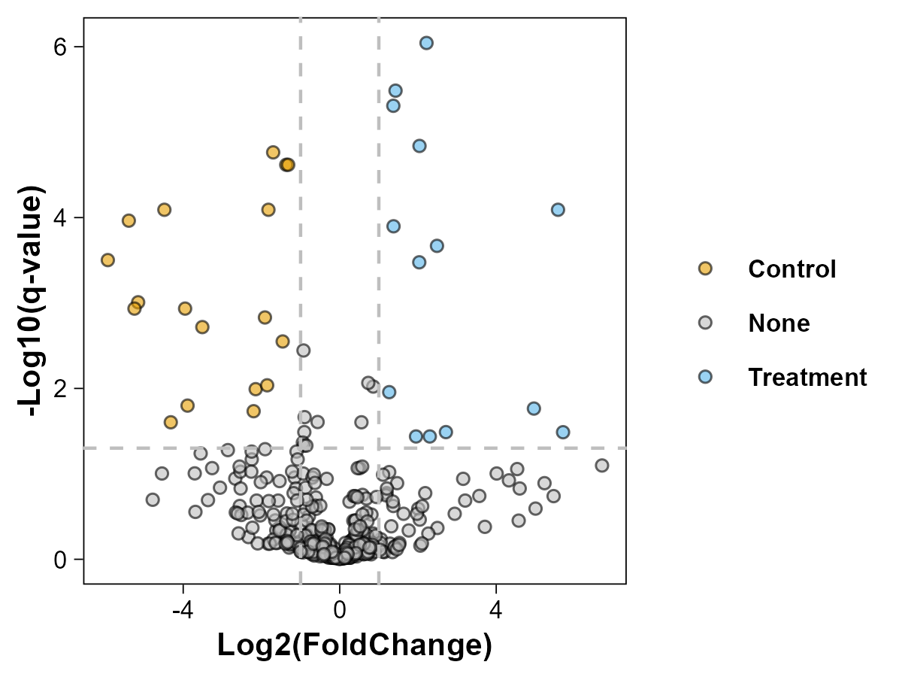

# LorMe
LorMe package for R：Lightening One-code Resolving Microbial Ecology Program

# Installation
development version from GitHub :stuck_out_tongue_closed_eyes:
```{R}
if (!require(remotes)) install.packages("remotes")
remotes::install_github("wangnq111/LorMe-package/LorMe")
```

# Illustration
## Chinese version
Chinese illustration available at 🏮 [LorMe中文版说明书](https://rural-dianella-be0.notion.site/LorMe-aac2ba66a3bf46bd89c103e78550e6f4) 🏮
## Visualization

### Community Feature
#### Alpha diversity


#### Community Structure


#### Community Composition


### Differential Analysis
#### Differential Bar


#### Volcano Plot

